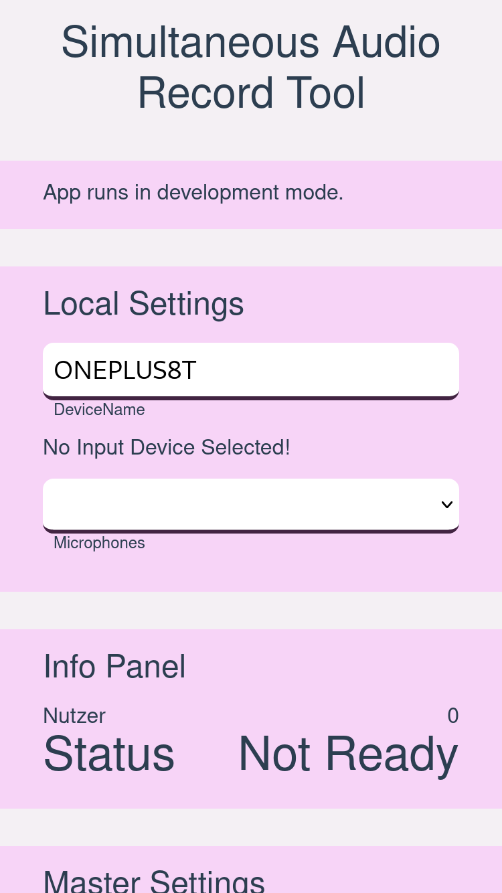
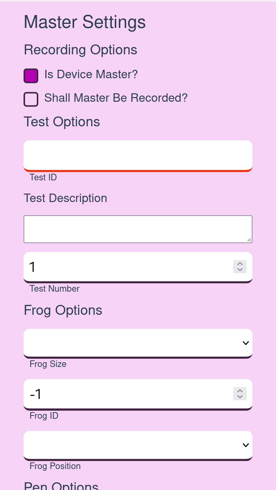
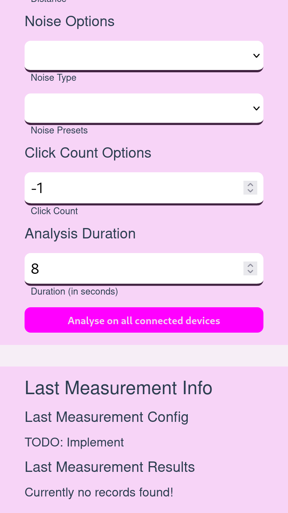
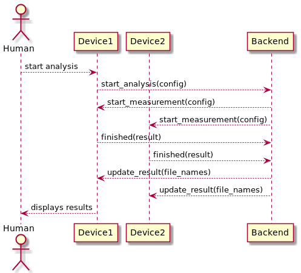

# Simultaneous Recording Tool For Web

This project was created during a master thesis. 

It was required to record audio with multiple smartphones at the same time.
This directory includes all contents that are required to build and start the simultaneously recording tool. It also includes python scripts to analyse the recorded sound data thereafter. 

## Repository Structure
- 📁 `analyser`: Python project that includes scripts to run the different analysis that are presented in the thesis
- 📁 `backend`: Backend flask server that coordinate the sound measurement process and store the sound data thereafter
- 📁 `docu`: diagrams to document the system design of the backend and frontend part
- 📁 `frontend`: A vue3 project that build the frontend of the simultaneous recording tool
- 📄 `docker-compose.yml`: Builds and starts the simultaneously recording tool production ready (Both backend and frontend)
- 📄 `Dockerfile`: Docker build script to build the flask server

## Screen Design
The left figure below shows the UI of the tool. It allows to select a specific id
for each device that is then sent as the device identifier. The microphone of
the device can also be selected if the used device has multiple microphones
installed. If the device id is inserted, a microphone was selected and the web application could successful connect to the backend, the state is
changed to ready. If the recording process is started, the state is changed
to recording and will return to ready when the recording is finished.
Lastly, the current count of clients connected to the server is visible
under the key ”Users”. On each client, the recording is started once it has
received the signal from the server. If a device is reconnected, the count
shows a higher number than the connected device count because the
server tries to reconnect with the old device connection. After a certain
timeout, the number would be corrected.

  
  
  

To be able to do all tests that are needed for the calibration tests, the main
configuration options that are shown besides the first one. To
use these options the checkbox `Is Device Master?` needs to be activated.
The purpose of the master device is to define the test configuration for
all devices. As a default, the master device is not be recorded. This can
be changed with the checkbox `Shall Master Be Recorded?`. To be able
to take a record, a test id, a test description and an analysis duration
need to be defined. After that, the recording on all connected devices
can be started with the button `Analyse on all connected devices`. For
the different calibration tests like the ground truth or frog calibration
test, different optional configuration entries could be filled. For example,
to run a frog test with ten clicks on a distance of arms with the frog
one of the size small at the position open thumb, the additional frog,
distance and click options can be configured. Only the filled entries of the
configuration will be stored in JSON format in every device’s recording.

## Data flow
The internal procedure for a measurement is shown in the Figure below. After the
user has entered the recording configuration in the web form using the
Device1, the application sends a start analysis event to the backend via
the web socket connection. Then, the backend broadcasts the start mea-
surement event with the given config to all connected devices. After the
devices received the event, they record the sound using the transmitted
configuration and send then the results back to the backend. The backend
saves the results into files per device and broadcasts update messages
that contain a list of the currently saved device results. Devices that are
marked as master display the device list so the successful transmission of
all devices can be checked.

